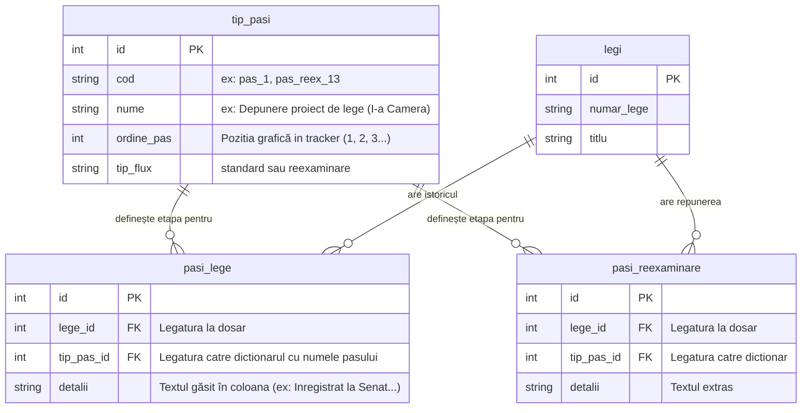

# Recapitulare și Export Conversație: Refactorizare Tracker Legislativ

**Data Exportului**: 30 Martie 2026
**Ejectiv Principal**: Optimizarea completă a modului în care pașii legislativi sunt mapați din datele extrase (CSV/NeonDB) și afișați în interfață, eliminând datele redundante și conflictele între prima și a doua cameră decizională.

---

## 1. Problema Inițială
Parsarea `pasi_lege` se realiza anterior combinând tot istoricul (timeline-ul) la grămadă. Din cauza amestecării informațiilor (de ex. texte de la CD alături de cele de la Senat), pașii se dublau sau bifele apăreau incorect. Mai mult, baza de date scria forțat 22 de linii pentru fiecare din cele peste 8000 de legi, generând **~180.000 de rânduri** (majoritatea goale / neatinse).

## 2. Abordarea Hibridă: Mapare Strictă pe Coloane
Am convenit să abandonăm logica bazată exclusiv pe Regex de-a lungul întregului timeline și am implementat un sistem **1-la-1** țintit, pe fiecare coloană:
*   **Pasul 1 (Depunere):** Citește regex doar dacă cuvintele există strict în coloana `Inregistrare`. 
*   **Pasul 2 (Prezentare BP):** Citește doar din coloana `Biroul permanent (prima camera)`.
*   **Pasul 3 (Stadiu):** Extrage direct din coloana `Stadiu` DOAR dacă Prima Cameră este Senatul. Dacă prima cameră a fost Camera Deputaților, acest pas e lăsat gol.

*Notă:* Orice verificare de la pașii 1-8 ține cont acum strict și sigur de `prima_cam_code` (Senat vs. CD) pentru a aplica Regex-ul corect, netrezindu-se amestecate.

## 3. Optimizarea Bazei de Date (Schema Dicționar)
Am modificat fișierul de ETL (`normalize_to_neondb.py`) pentru a trece baza de date la standardul 3NF.
Am creat o tabelă statică unică de dicționar numită **`tip_pasi`** (care conține 37 de pași canonici - standard și de reexaminare). 

Tabela enormă `pasi_lege` nu mai stochează text greoi cu numele etapei (ex: "Depunere proiect de lege (I-a Camera)"), ci doar ID-ul de legătură spre dicționar (`tip_pas_id`) și TEXTUL real descărcat de pe site.

### Impact Uriaș de Performanță:
În loc să adăugăm pașii neatinși, acum îi scriem doar pe cei pe care legea i-a bifat efectiv.
* **Vechi:** ~180.000 de rânduri inutile.
* **Nou:** Strict **27.388 rânduri** valoroase scrise în NeonDB. Scădere masivă a dimensiunii tabelei, cu o viteză de Query mult mai mare!

## 4. Schema Bazei de Date (ERD Nou)

## 5. Ce urmează să dezvoltăm (Next Steps)
1. **App.py (Interfața Tracker-ului):** Trebuie să modifice query-ul de la baza de date pentru a face `JOIN` între `pasi_lege` și `tip_pasi`, fiindcă textele de Tracker trebuie extrase acum de acolo.
2. **Implementare Pași 4 - 8:** Să decidem coloanele brute din care extragem textele canonice pentru avize, trimiteri la comisii și restul drumului în Prima Cameră.
