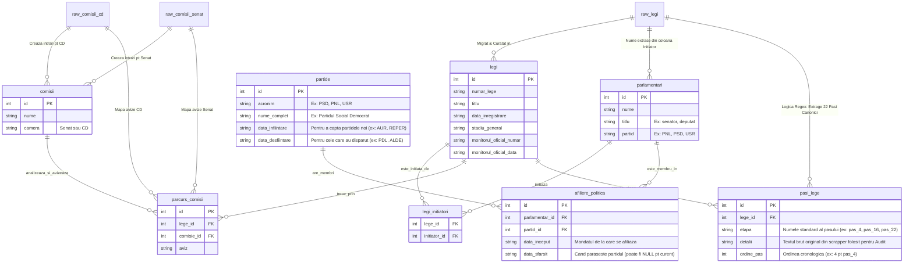

# Schema Bazei de Date (ER Diagram) cu Date Brute (RAW) și Partide Politice

Acesta este modelul entitate-relație (ERD) vizual care ilustrează felul în care **datele brute (RAW)** curg în structura **normalizată**, dar și noul modul propus pentru **Partide Politice**.

### Funcționarea "pasi_lege" (State Machine cu 22 de Etape)
Noua arhitectură a renunțat la copierea directă a textelor de pe site-uri ca "Stadii". În schimb, un algoritm de parsare (Regex) traversează cronologia fiecărei legi și o mapează pe un parcurs standard (canon) cu **22 de pași prestabiliți** (și 15 pași de reexaminare). 

Pașii inteligenți țin cont automat dacă o lege a plecat din Senat sau de la CD, și folosesc un `offset (+8)` pentru Camera 2. Exemple:
- `pas_1`: *Depunere proiect de lege (I-a Camera)*
- `pas_8`: *Vot Plen (I-a Camera)*
- `pas_9`: *Depunere proiect de lege (II-a Camera)*
- `pas_22`: *Publicata in Monitorul Oficial*

Aceasta înseamnă că interfața vizuală (Dashboard UI) folosește aceste ID-uri de pași pentru a aprinde sau stinge bulinele dintr-un Tracker modern, știind 100% sigur la ce pas a ajuns un dosar.

### De ce o tabelă intermediară (`afiliere_politica`)?
În politica din România (și din 2010 până în prezent), "traseismul politic" este foarte frecvent (parlamentarii trec de la un partid la altul pe parcursul mandatelor). Dacă am pune doar un câmp `partid_id` direct pe tabelul `parlamentari`, am ști doar partidul lor de *acum*. Prin tabela intermediară `afiliere_politica` (care stochează perioadele `data_inceput` - `data_sfarsit`), vom putea analiza exact din ce partid făcea parte un parlamentar **în momentul în care a inițiat o anumită lege**.
